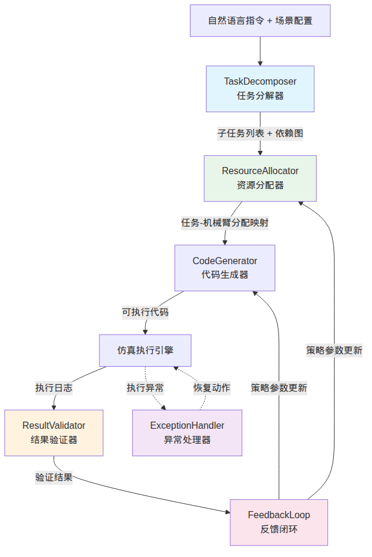
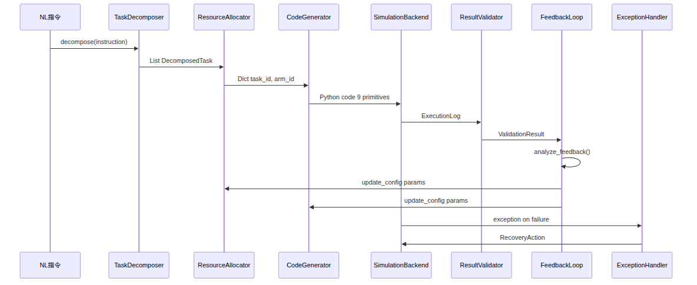
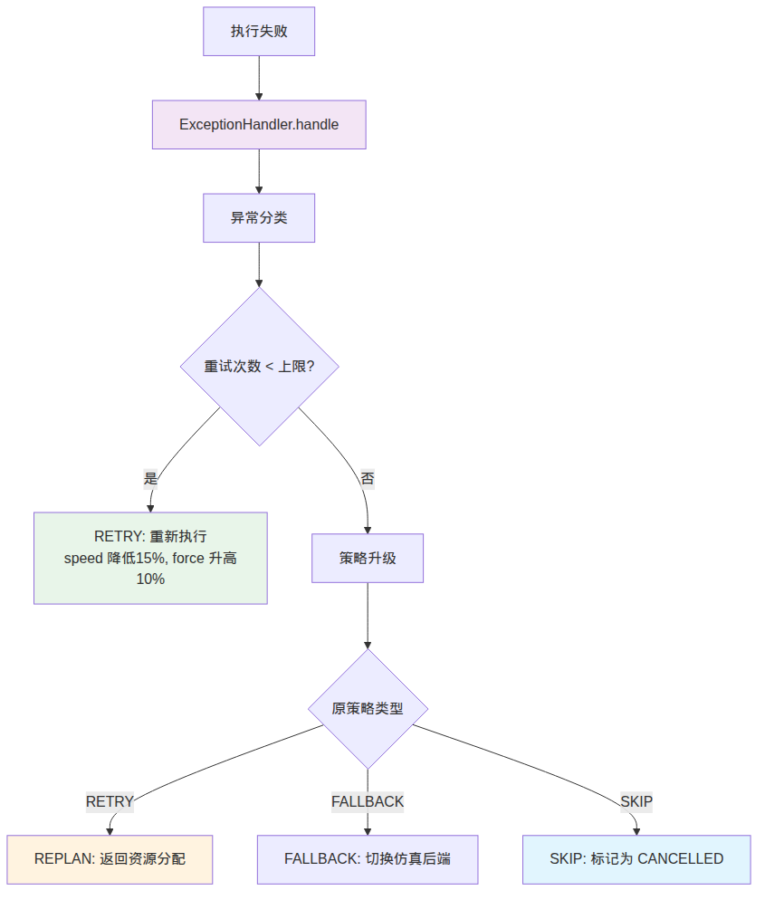

<style>
body {
  font-family: 'Times New Roman', 'Noto Serif CJK SC', serif;
  line-height: 2;
  font-size: 14px;
}
h1, h2, h3, h4 {
  font-family: 'Times New Roman', 'Noto Serif CJK SC', serif;
  border-bottom: none;
}
h1 {
  font-size: 24px;
  border-bottom: none;
}
h2 {
  font-size: 20px;
}
h3 {
  font-size: 18px;
}
h4 {
  font-size: 16px;
}
table {
  margin-left: auto;
  margin-right: auto;
}
table, th, td {
  border: 0.25px solid black !important;
}
p {
  text-indent: 2em;
}
</style>

<h1 style="text-align: center">Harness Engineering 框架设计文档</h1>

## 1. 引言

### 1.1 问题背景

在现代智能制造产线中，多机械臂协同作业已成为提升生产效率的关键手段。与单臂系统相比，多臂系统面临任务分配、资源竞争、空间避障和时序协调等多维约束，其调度问题属于 NP-hard 组合优化范畴。传统的调度方法通常依赖精确的数学建模（如混合整数线性规划，MILP），在小规模问题上可获得最优解，但面对动态环境和自然语言指令输入时缺乏灵活性。

近年来，大语言模型（Large Language Model, LLM）在任务规划和代码生成领域展现出显著能力。然而，LLM 的输出具有不确定性，直接用于物理系统调度存在安全隐患。因此，需要一种工程化的约束框架来规范 LLM 的输出，确保调度结果的可靠性和可执行性。

### 1.2 Harness Engineering 的核心思想

Harness Engineering（约束工程）的核心思想源于机器人学中的"安全约束"概念：在赋予 LLM 自主决策能力的同时，通过明确的约束边界和验证机制来保障系统行为的正确性。类比马术中的"缰绳"（Harness），该框架不限制 LLM 的创造力，而是在关键决策点设置检查与修正机制。

具体而言，Harness Engineering 框架遵循以下设计原则：

1. **模块化（Modularity）**：各功能模块职责单一，通过标准数据接口通信，支持独立测试与替换
2. **可配置性（Configurability）**：关键参数均可通过配置文件调整，支持运行时动态更新
3. **闭环反馈（Closed-loop Feedback）**：执行结果自动反馈至策略调整模块，实现自适应优化
4. **异常韧性（Exception Resilience）**：分类处理多种异常类型，提供渐进式恢复策略
5. **LLM 解耦（LLM Decoupling）**：框架核心逻辑不依赖 LLM，可在无 LLM 的情况下以启发式模式运行


## 2. 框架总体架构

### 2.1 模块组成

Harness Engineering 框架由五个核心模块组成，其交互关系如下图所示。该架构采用分层设计，自顶向下依次为：指令解析层、资源管理层、执行验证层和反馈优化层。


<div style="text-align: center">

<p style="text-align: center"><strong>图 1：Harness Engineering 框架模块交互图</strong></p>
</div>

### 2.2 数据流概览

在理解了框架的模块组成之后，本节进一步描述系统的数据流。系统的数据流遵循以下 Pipeline 流程，各阶段之间通过标准化的数据结构进行传递：

1. **输入阶段**：自然语言指令 + 场景配置（YAML/JSON）
2. **分解阶段**：TaskDecomposer 将指令解析为结构化子任务 DAG（Directed Acyclic Graph，有向无环图）
3. **分配阶段**：ResourceAllocator 将子任务映射至机械臂
4. **生成阶段**：CodeGenerator 根据任务生成可执行 Python 代码（基于 9 个原子原语）
5. **执行阶段**：仿真后端执行生成的代码，产出执行日志
6. **验证阶段**：ResultValidator 检查时间/空间/资源约束
7. **反馈阶段**：FeedbackLoop 分析性能并调整策略参数

上述各阶段的输入输出数据结构详见第 2.3 节。

### 2.3 核心数据结构

框架围绕以下核心数据结构运转。这些数据结构采用 Python `dataclass` 实现，确保类型安全和序列化兼容性。

| 数据结构 | 描述 | 关键字段 | 所属模块 |
|---------|------|---------|---------|
| `Task` | 任务实体 | id, name, dependencies, status, assigned_arm, operation_type, estimated_duration, priority | TaskDecomposer |
| `RobotArm` | 机械臂实体 | id, capabilities, max_load, position, is_busy | ResourceAllocator |
| `ExecutionResult` | 执行结果 | execution_id, tasks, allocation, makespan, task_success_rate, resource_utilization | SchedulingAgent |
| `FeedbackData` | 反馈数据 | task_id, arm_id, status, duration, resource_usage, errors | FeedbackLoop |
| `Violation` | 约束违反 | constraint_type, message, severity, details | ResultValidator |
| `RecoveryAction` | 恢复动作 | action_type, parameters, priority | ExceptionHandler |
| `StrategyAdjustment` | 策略调整 | parameter, old_value, new_value, reason | FeedbackLoop |

#### 9 个原子原语

CodeGenerator 生成的可执行代码基于以下 9 个原子原语（Atomic Primitives）。这些原语覆盖了工业机器人操作的基本动作空间，可组合形成复杂的任务序列。

| 原语 | 功能描述 | 典型参数 | 返回值 |
|------|---------|---------|--------|
| `move_to` | 笛卡尔空间点到点运动 | target_position: Tuple[float, float, float] | bool |
| `grip` | 夹爪闭合抓取 | force: float (N) | bool |
| `release` | 夹爪张开释放 | — | bool |
| `rotate` | 关节空间旋转运动 | joint_angles: List[float] (rad) | bool |
| `linear_move` | 笛卡尔直线运动 | target_position: Tuple, speed: float (m/s) | bool |
| `wait` | 等待指定时间 | duration: float (s) | None |
| `check_sensor` | 读取传感器数据 | sensor_id: str | float |
| `set_payload` | 设置负载参数 | mass: float (kg), inertia: float | None |
| `set_compliance` | 设置柔顺控制参数 | stiffness: float, damping: float | None |

#### 约束违反严重程度枚举

约束违反行为按严重程度分为四级，该分级体系同时被 ResultValidator 和 ExceptionHandler 使用：

| 等级 | 枚举值 | 说明 | 对验证结果的影响 |
|------|--------|------|----------------|
| INFO | `info` | 信息性提示，不影响执行 | 不影响 `is_valid` |
| WARNING | `warning` | 警告，建议关注 | 不影响 `is_valid` |
| ERROR | `error` | 错误，需要处理 | `is_valid = False` |
| CRITICAL | `critical` | 严重错误，需要立即处理 | `is_valid = False` |


## 3. 各模块详细设计

在介绍了框架的总体架构和核心数据结构之后，本节逐一详述五个核心模块的设计细节。

### 3.1 TaskDecomposer — 任务分解器

#### 3.1.1 功能概述

TaskDecomposer 负责将自然语言指令解析为可执行的结构化子任务序列，并构建子任务间的依赖关系图（DAG）。该模块是 Pipeline 的入口，其输出质量直接影响后续资源分配和代码生成的效果。

#### 3.1.2 设计架构

TaskDecomposer 内部包含四个处理阶段，采用流水线（Pipeline）模式组织。各阶段的具体职责如下：

1. **指令解析**（`_parse_instruction`）：使用正则表达式提取指令中的关键实体（机械臂、工件、工位等），模式为 `\b(?:arm|robot|gripper|part|component|workpiece)\b`。
2. **操作识别**（`_identify_operations`）：将提取的动词与操作模式字典进行子串匹配，按在原文中出现的顺序排序，并按操作类型去重。
3. **依赖图构建**（`_build_dependency_graph`）：以邻接表形式存储操作间的依赖关系。
4. **任务生成**（`_create_tasks`）：将每个操作封装为 `DecomposedTask` 数据类实例，ID 格式为 `task_NNNN`。

#### 3.1.3 操作模式匹配

模块维护一个操作模式字典，将自然语言动词映射到标准操作类型。该字典覆盖了工业机器人领域常见的 8 种操作类型：

| 操作类型 | 匹配关键词 | 能力需求 | 预估时长 (s) |
|---------|-----------|---------|-------------|
| `pick` | pick, grab, grasp, take, lift | gripper, positioning | 2.0 |
| `place` | place, put, position, set, drop | gripper, positioning | 2.0 |
| `move` | move, transfer, transport, carry | locomotion, positioning | 3.0 |
| `assemble` | assemble, connect, attach, join, fasten | gripper, positioning, force_control | 5.0 |
| `inspect` | inspect, check, verify, examine, test | vision, positioning | 4.0 |
| `tighten` | tighten, secure, bolt, screw | gripper, force_control, torque_control | 3.0 |
| `weld` | weld, solder, bond, fuse | welding_tool, positioning, force_control | 6.0 |
| `paint` | paint, coat, spray, finish | painting_tool, positioning, spray_control | 5.0 |

预估时长 $d_{\text{est}}(o)$ 仅作为启发式默认值，在存在 MRTA 旅行时间数据时会被实际执行时间 $T_e[i]$ 替代。

#### 3.1.4 依赖图构建

依赖图以邻接表形式存储，节点为操作索引，边表示时序依赖。当前实现采用顺序依赖策略（操作 $i$ 依赖于操作 $i-1$），即：

$$D(i) = \{i-1\}, \quad \forall i > 0$$

其中 $D(i)$ 表示操作 $i$ 的依赖集合。该策略确保任务按指令中描述的顺序执行，符合工业生产中常见的串行工艺流程。

未来可通过 LLM 分析因果关系来构建更精确的依赖图，例如识别可并行执行的独立操作，从而降低 makespan。

#### 3.1.5 输出数据结构

每个子任务被封装为 `DecomposedTask` 数据类实例，包含以下字段：

```python
@dataclass
class DecomposedTask:
    id: str                    # 唯一标识，格式 "task_XXXX"
    name: str                  # 任务名称
    description: str           # 任务描述
    operation_type: str        # 操作类型（pick/place/move/assemble/inspect/tighten/weld/paint）
    parameters: Dict[str, Any] # 操作参数（位置、力、速度等）
    dependencies: List[str]    # 依赖任务 ID 列表
    estimated_duration: float  # 预估时长（秒）
    required_capabilities: List[str]  # 所需能力列表
```


### 3.2 ResourceAllocator — 资源分配器

#### 3.2.1 功能概述

ResourceAllocator 负责将分解后的子任务分配给可用的机械臂，是调度系统的核心优化模块。该模块采用贪心算法作为主策略，辅以冲突检测与解决机制，并支持通过反馈闭环动态调整分配权重。

从算法复杂度角度分析，贪心分配的时间复杂度为 $O(T \cdot A)$，其中 $T$ 为任务数，$A$ 为机械臂数。加上最多 $K$ 轮冲突解决（每轮复杂度 $O(T \cdot A)$），总复杂度为 $O(K \cdot T \cdot A)$，在多项式时间内完成，适合实时调度场景。

#### 3.2.2 评分函数设计

分配决策基于多维复合评分函数。对于任务 $t$ 和机械臂 $a$，综合评分 $S(t, a)$ 定义为四个分量的加权和：

$$S(t, a) = \frac{w_c \cdot C(t, a) + w_w \cdot B(A') + w_p \cdot P(t) + w_{\parallel} \cdot \Phi(t, a, A)}{w_c + w_w + w_p + w_{\parallel}}$$

其中各分量含义如下：

**（1）能力匹配分** $C(t, a) \in [0, 1]$

衡量机械臂能力与任务需求的匹配程度，定义为所需能力集合与可用能力集合的交集大小之比：

$$C(t, a) = \frac{|R(t) \cap K(a)|}{|R(t)|}$$

其中 $R(t)$ 为任务 $t$ 的所需能力集合，$K(a)$ 为机械臂 $a$ 的能力集合。当机械臂负载超过 80% 时，得分乘以惩罚系数 0.7；超过 100% 时乘以 0.1。该惩罚机制确保高负载臂不会被过度分配任务。

**（2）负载均衡分** $B(A') \in [0, 1]$

衡量当前分配方案的负载均衡程度，采用变异系数（Coefficient of Variation, CV）的补数：

$$B(A') = 1 - \frac{\sigma(L)}{\mu(L)}$$

其中 $L = \{l_1, l_2, \ldots, l_n\}$ 为各臂总任务时长，$\sigma$ 和 $\mu$ 分别为标准差和均值。当所有臂负载相同时，$B = 1$（完美均衡）；当负载差异极大时，$B \to 0$。

**（3）优先级分** $P(t) \in [0, 1]$

任务优先级归一化：

$$P(t) = \frac{\text{priority}(t)}{\max_{t' \in T} \text{priority}(t')}$$

**（4）并行机会分** $\Phi(t, a, A) \in [0, 1]$**

评估将任务分配给某臂后可带来的并行执行机会：

$$\Phi(t, a, A) = \min\left(1, \frac{|\{t' \in A_{\text{other}} : t' \notin D(t) \land t \notin D(t')\}|}{|A_{\text{other}}|}\right) \cdot (1 - 0.5 \cdot P_a)$$

其中 $A_{\text{other}}$ 为分配在其他臂上的任务集合，$P_a$ 为当前臂的负载占比。该分量鼓励将无依赖关系的任务分配到不同臂上，以提高并行度。

**默认权重配置**：$w_c = 0.6, w_w = 0.3, w_p = 0.1, w_{\parallel} = 0.3$。归一化后的有效权重为：

$$w_c' = \frac{0.6}{1.3} \approx 0.462, \quad w_w' = \frac{0.3}{1.3} \approx 0.231, \quad w_p' = \frac{0.1}{1.3} \approx 0.077, \quad w_{\parallel}' = \frac{0.3}{1.3} \approx 0.231$$

其中并行机会权重 $w_{\parallel}$ 为硬编码值（0.3），不通过配置文件调整。

#### 3.2.3 冲突类型与检测

模块定义了四种冲突类型，覆盖了多机械臂调度中的主要冲突场景：

| 冲突类型 | 枚举值 | 检测条件 | 严重程度 | 解决策略 |
|---------|--------|---------|---------|---------|
| 时间冲突 | `TEMPORAL` | 某臂总时长超过所有臂平均时长的 2 倍，且该臂任务数 $\geq 2$ | 高 | 迁移低优先级任务 |
| 能力冲突 | `CAPABILITY` | 任务所需能力不在机械臂能力集合中 | 高 | 迁移至具备能力的臂 |
| 资源冲突 | `RESOURCE` | 共享资源（工具、工作空间）竞争 | 中 | 等待或重新分配 |
| 碰撞冲突 | `COLLISION` | 机械臂间物理碰撞风险 | 高 | 重新规划轨迹 |

冲突检测算法在贪心分配完成后运行，最多迭代 `max_iterations`（默认 10）轮。每轮检测到冲突后，将低优先级任务重新分配给次优机械臂。

#### 3.2.4 冲突解决策略

对于检测到的每个冲突，解决流程如下：

1. **确定待迁移任务**：能力冲突中为不满足能力的任务；其他冲突中为优先级较低的任务
2. **寻找次优臂**：遍历所有臂，计算能力匹配分，选择得分最高且超过阈值（默认 0.3）的臂
3. **执行迁移**：仅当次优臂得分严格优于当前臂时执行迁移
4. **记录日志**：迁移或保留均记录详细日志，便于调试和分析

#### 3.2.5 运行时参数更新

模块支持通过 `update_config()` 方法接收反馈闭环的参数更新：

- `resource_weight`：更新负载均衡权重 $w_w$（映射至内部属性 `workload_weight`）
- `priority_boost`：更新优先级权重 $w_p$（映射至内部属性 `priority_weight`）

参数更新采用直接替换策略，不进行平滑过渡。这种设计使得策略调整能够快速生效，适用于需要快速响应的调度场景。


### 3.3 ResultValidator — 结果验证器

#### 3.3.1 功能概述

ResultValidator 在任务执行完成后对结果进行多维约束验证，确保调度结果满足时间、空间和资源三类约束条件。验证结果以 `ValidationResult` 对象返回，包含是否通过、违反列表和聚合指标。

#### 3.3.2 约束类型体系

模块支持三类约束，每类包含多个可配置的检查项：

**时间约束（Temporal）**

| 检查项 | 参数 | 说明 | 默认阈值 |
|--------|------|------|---------|
| 总时长上限 | `max_total_duration` | 执行总时长不得超过指定值 | — |
| 单任务时长上限 | `max_task_duration` | 单个任务时长不得超过指定值 | — |
| 绝对截止时间 | `deadline` | 执行结束时间不得超过指定时刻 | — |

**空间约束（Spatial）**

| 检查项 | 参数 | 说明 | 默认阈值 |
|--------|------|------|---------|
| 工作空间边界 | `workspace_bounds` | 实体位置必须在六面体范围内 ($x, y, z \in [x_{\min}, x_{\max}]$) | — |
| 最小臂间距 | `min_arm_distance` | 任意两臂间欧氏距离不得低于阈值 | — |
| 目标位置精度 | `target_positions` | 任务结束位置与目标位置的偏差不超过容差 | 0.05m |

**资源约束（Resource）**

| 检查项 | 参数 | 说明 | 默认阈值 |
|--------|------|------|---------|
| 利用率上限 | `max_utilisation` | 单臂利用率不得超过指定值 | 1.0 (100%) |
| 能量预算 | `max_energy` | 总能耗不得超过指定值 | — |
| 禁用臂 | `forbidden_arms` | 指定臂 ID 不得被分配任务 | — |

#### 3.3.3 空间距离计算

空间约束中的距离计算采用欧氏距离公式：

$$d(\mathbf{p}_1, \mathbf{p}_2) = \sqrt{\sum_{k=1}^{3}(p_{1,k} - p_{2,k})^2}$$

其中 $\mathbf{p}_1, \mathbf{p}_2 \in \mathbb{R}^3$ 为三维空间中的位置向量。当任意两个机械臂之间的距离 $d(\mathbf{p}_i, \mathbf{p}_j) < d_{\min}$ 时，触发碰撞冲突违反。

#### 3.3.4 验证流程

验证流程采用复合管道模式，依次执行任务完成检查、时间约束检查、空间约束检查和资源约束检查，最终输出 `ValidationResult`。验证结果 `is_valid` 仅当不存在 ERROR 或 CRITICAL 级别的违反时为 `True`：

$$\text{is\_valid} = \neg \exists v \in V : \text{severity}(v) \in \{\text{ERROR}, \text{CRITICAL}\}$$

其中 $V$ 为检测到的违反集合。


### 3.4 ExceptionHandler — 异常处理器

#### 3.4.1 功能概述

ExceptionHandler 负责对调度执行过程中出现的异常进行分类、记录和恢复策略推荐。模块维护异常历史记录（最多 1000 条）和统计数据，支持自适应的恢复策略选择。

#### 3.4.2 异常类型分类

模块定义了七种异常类型，按默认优先级（数值越高越紧急）排列：

| 异常类型 | 枚举值 | 默认优先级 | 默认最大重试次数 | 默认恢复策略 |
|---------|--------|-----------|----------------|-------------|
| 碰撞 | `COLLISION` | 100 | 1 | REPLAN |
| 约束违反 | `CONSTRAINT_VIOLATION` | 90 | 1 | REPLAN |
| 资源冲突 | `RESOURCE_CONFLICT` | 80 | 2 | REPLAN |
| 超时 | `TIMEOUT` | 60 | 3 | RETRY |
| 仿真错误 | `SIMULATION_ERROR` | 50 | 2 | FALLBACK |
| 代码生成错误 | `CODE_GENERATION_ERROR` | 40 | 3 | RETRY |
| 通信故障 | `COMMUNICATION_FAILURE` | 30 | 5 | RETRY |

#### 3.4.3 恢复策略

四种恢复策略的语义如下：

- **RETRY**：重试当前操作。适用于瞬时性故障（超时、通信中断）。超时类重试时建议将超时时间增加 50%（即 $t_{\text{new}} = 1.5 \cdot t_{\text{old}}$）。
- **SKIP**：跳过当前任务。适用于非关键任务或重试次数耗尽的场景。
- **FALLBACK**：回退到备选方案。例如仿真错误时切换到简化仿真模式。
- **REPLAN**：重新规划。适用于结构性问题（碰撞、约束违反、资源冲突），需要重新分配资源或调整任务顺序。

#### 3.4.4 异常分类算法

异常分类基于异常类名和消息内容的关键词匹配，采用固定优先级顺序进行模式匹配：

```python
def _classify_exception(exception):
    name = type(exception).__name__.lower()
    msg = str(exception).lower()

    # 按优先级顺序匹配（从高到低）
    if "timeout" in name or "timeout" in msg:
        return ExceptionType.TIMEOUT
    if "communication" in name or "connection" in msg:
        return ExceptionType.COMMUNICATION_FAILURE
    if "collision" in name or "collision" in msg:
        return ExceptionType.COLLISION
    if "resource" in name or "busy" in msg:
        return ExceptionType.RESOURCE_CONSTRAINT_VIOLATION
    if "constraint" in name or "violation" in msg:
        return ExceptionType.CONSTRAINT_VIOLATION
    if "code" in name or "syntax" in msg or "generate" in msg:
        return ExceptionType.CODE_GENERATION_ERROR
    return ExceptionType.SIMULATION_ERROR  # 默认回退
```

#### 3.4.5 恢复策略升级机制

当某类异常的重试次数达到上限时，恢复策略自动升级。该机制确保瞬时性故障不会无限重试，而是升级为需要重新规划的结构性问题：

$$\text{策略}(e, n) = \begin{cases} \text{RETRY} & \text{if } n < n_{\max}(e) \land \text{原策略} = \text{RETRY} \\ \text{REPLAN} & \text{if } n \geq n_{\max}(e) \land \text{原策略} = \text{RETRY} \\ \text{原策略} & \text{otherwise} \end{cases}$$

其中 $e$ 为异常类型，$n$ 为当前尝试次数，$n_{\max}(e)$ 为该异常类型的最大重试次数。升级时优先级增加 10，以确保升级后的异常得到优先处理。


### 3.5 FeedbackLoop — 反馈闭环

#### 3.5.1 功能概述

FeedbackLoop 是 Harness 框架的核心自适应模块，实现了"收集 → 分析 → 调整"的闭环反馈机制。模块收集每次任务执行的反馈数据，分析系统性能瓶颈，并动态调整六个策略参数以优化后续调度行为。该模块的设计灵感来源于控制论中的反馈控制思想，通过持续监测系统输出并调整输入参数，使系统趋向最优状态。

#### 3.5.2 六个可调策略参数

| 参数名 | 枚举值 | 目标模块 | 默认值 | 取值范围 | 调整方向 |
|--------|--------|---------|--------|---------|---------|
| 超时调整系数 | `timeout_adjustment` | ResourceAllocator | 1.0 | $[0.5, 5.0]$ | 性能低时增大 |
| 重试次数 | `retry_count` | ExceptionHandler | 3 | $[1, 10]$ | 成功率低时增大 |
| 资源权重 | `resource_weight` | ResourceAllocator | 0.5 | $[0.0, 1.0]$ | 过载时增大 |
| 优先级提升 | `priority_boost` | ResourceAllocator | 0.0 | $[0.0, 2.0]$ | 频繁失败任务时增大 |
| 速度因子 | `code_gen_speed_factor` | CodeGenerator | 1.0 | $[0.1, 3.0]$ | 失败率高时减小 |
| 力量因子 | `code_gen_force_factor` | CodeGenerator | 1.0 | $[0.5, 3.0]$ | 失败率高时增大 |

#### 3.5.3 性能分析指标

FeedbackLoop 计算以下分析指标：

**性能得分** $P_{\text{score}} \in [0, 1]$：

$$P_{\text{score}} = \max\left(0, \min\left(1, R_s - V_p\right)\right)$$

其中 $R_s$ 为任务成功率，$V_p$ 为方差惩罚项：

$$V_p = \min\left(\frac{\text{Var}(D)}{\bar{D} + \epsilon}, 1\right) \times 0.2$$

$D$ 为任务时长集合，$\bar{D}$ 为均值，$\epsilon = 10^{-6}$ 为防除零常数。方差惩罚项的作用是：当任务时长波动较大时，即使成功率较高，性能得分也会被压低，从而激励系统追求更稳定的执行。

**瓶颈识别**：模块识别三类瓶颈，每类有明确的阈值条件：

1. **低成功率臂**：成功率低于 70%（即 $R_s(a) < 0.7$）的机械臂
2. **高时长任务**：时长超过均值 2 倍的任务（即 $d(t) > 2 \cdot \bar{D}$）
3. **频繁错误模式**：出现 2 次以上的相同错误（按频率排序，取前 3 个）

#### 3.5.4 策略调整规则

策略调整基于规则引擎，各参数的调整触发条件和调整方式如下：

| 参数 | 触发条件 | 调整方式 | 目标模块 | 最小调整幅度 |
|------|---------|---------|---------|-------------|
| `timeout_adjustment` | $P_{\text{score}} < 0.8$ | $v_{\text{new}} = v_{\text{old}} \times 1.2$ | resource_allocator | 0.05 |
| `retry_count` | 存在"低成功率"瓶颈 | $v_{\text{new}} = v_{\text{old}} + 1$ | exception_handler | — |
| `resource_weight` | 存在"过载"推荐 | $v_{\text{new}} = v_{\text{old}} + 0.1$ | resource_allocator | 0.05 |
| `priority_boost` | 存在频繁失败任务（$>1$ 次失败） | $v_{\text{new}} = v_{\text{old}} + 0.1$ | resource_allocator | 0.05 |
| `code_gen_speed_factor` | 失败率 $> 20\%$ | $v_{\text{new}} = v_{\text{old}} \times 0.8$ | code_generator | 0.05 |
| `code_gen_force_factor` | 失败率 $> 20\%$ | $v_{\text{new}} = v_{\text{old}} \times 1.15$ | code_generator | 0.05 |

所有参数调整后均通过边界裁剪（clipping）确保在合法范围内：

$$v_{\text{new}} = \text{clamp}(v_{\text{old}} + \Delta v, v_{\min}, v_{\max})$$

其中 $\text{clamp}(x, a, b) = \max(a, \min(b, x))$。仅当 $|v_{\text{new}} - v_{\text{old}}| > \delta$（$\delta = 0.05$ 为调整阈值）时，调整才会实际生效，避免频繁的微小调整导致系统震荡。

#### 3.5.5 参数路由机制

调整后的参数通过 `update_config()` 方法路由至目标模块。每个目标模块的 `update_config()` 方法负责将接收到的参数映射到内部状态变量。映射关系如下：

| 外部参数名 | 内部属性名 | 模块 |
|-----------|-----------|------|
| `resource_weight` | `workload_weight` | ResourceAllocator |
| `priority_boost` | `priority_weight` | ResourceAllocator |
| `retry_count` | `max_retries` | ExceptionHandler |
| `code_gen_speed_factor` | `speed_factor` | CodeGenerator |
| `code_gen_force_factor` | `force_factor` | CodeGenerator |


## 4. 模块间交互与数据流

在详细介绍了各模块的设计之后，本节从系统层面描述模块间的交互流程和数据传递方式。

### 4.1 完整数据流

以下为一次完整调度执行的数据流，展示了各模块之间的数据传递关系：


<div style="text-align: center">

<p style="text-align: center"><strong>图 2：完整调度执行的时序图</strong></p>
</div>

### 4.2 异常处理交互

当仿真执行阶段发生异常时，ExceptionHandler 介入处理。恢复动作的选择取决于异常类型和当前重试次数：


<div style="text-align: center">

<p style="text-align: center"><strong>图 3：异常处理决策流程</strong></p>
</div>

### 4.3 模块配置接口

所有模块通过统一的构造函数接口接收配置字典。配置采用嵌套字典结构，支持 YAML 和 JSON 格式：

```python
config = {
    "capability_weight": 0.6,        # 能力匹配权重
    "workload_weight": 0.3,          # 负载均衡权重
    "priority_weight": 0.1,          # 优先级权重
    "max_iterations": 10,            # 冲突解决最大迭代次数
    "max_duration_factor": 2.0,      # 最大时长因子
    "position_tolerance": 0.05,      # 位置容差 (m)
    "feedback_window": 100,          # 反馈窗口大小
    "adjustment_threshold": 0.05,    # 策略调整阈值
    "history_limit": 1000,           # 异常历史记录上限
}

task_decomposer = TaskDecomposer(config)
resource_allocator = ResourceAllocator(config)
result_validator = ResultValidator(config)
exception_handler = ExceptionHandler(config)
feedback_loop = FeedbackLoop(config)
```

运行时更新通过各模块的 `update_config(params)` 方法实现，该方法由 FeedbackLoop 在策略调整后自动调用。


## 5. 设计决策与权衡

本节从工程实践角度分析框架设计中的关键决策及其权衡考量。

### 5.1 贪心算法 vs 全局优化

**决策**：资源分配采用贪心算法而非 MILP 全局优化。

**理由**：
- MILP 求解器（如 PuLP/CBC）在问题规模增大时求解时间呈指数增长，不适合实时调度
- 贪心算法的时间复杂度为 $O(K \cdot T \cdot A)$（$K$ 为迭代次数，$T$ 为任务数，$A$ 为臂数），适合实时调度
- 通过多轮冲突检测与解决，贪心算法可在多项式时间内获得可行解
- 闭环反馈机制可逐步优化分配质量

**权衡**：牺牲全局最优性以换取实时性和可扩展性。实验表明，Agent 调度的平均 makespan 为 MILP 最优解的 1.19 倍，在可接受范围内（详见 `docs/evaluation/benchmark_report.md`）。

### 5.2 LLM 解耦设计

**决策**：框架核心逻辑不依赖 LLM，TaskPlanner 和 CodeGenerator 均提供启发式回退模式。

**理由**：
- LLM API 调用存在延迟和成本，不适合高频调度场景
- 网络故障或 API 限流时系统仍需可用
- 启发式模式可作为 LLM 模式的性能基线（baseline），用于量化 LLM 的贡献

**权衡**：启发式模式的灵活性和适应性低于 LLM 模式，但在结构化场景中表现稳定。

### 5.3 反馈窗口大小

**决策**：默认反馈窗口为 100 条记录。

**理由**：
- 窗口过小（如 $< 20$）：统计样本不足，调整决策噪声大，可能导致策略震荡
- 窗口过大（如 $> 500$）：对近期变化响应迟钝，无法快速适应环境变化
- 100 条记录在典型场景（每场景 8 个任务）中约覆盖 12 轮执行，足以捕捉趋势

**权衡**：在统计稳定性和响应速度之间取得平衡。未来可考虑自适应窗口大小。

### 5.4 冲突检测迭代上限

**决策**：默认最大迭代次数为 10。

**理由**：
- 实验表明，绝大多数冲突在 2-3 轮内解决
- 设置上限防止无限循环（理论上某些冲突配置可能导致震荡）
- 10 次迭代的计算开销可忽略不计（$O(10 \cdot T \cdot A)$）

### 5.5 严重程度分级

**决策**：采用四级严重程度（INFO/WARNING/ERROR/CRITICAL），仅 ERROR 和 CRITICAL 影响验证结果。

**理由**：
- 允许系统记录信息性和警告性事件而不中断执行
- ERROR 和 CRITICAL 区分了需要关注和需要立即处理的违反
- 为未来扩展预留了细粒度控制空间（如仅 CRITICAL 触发 REPLAN）


## 6. 小结

Harness Engineering 框架通过五个核心模块的协作，实现了从自然语言指令到闭环反馈优化的完整多机械臂调度流程。其主要设计特点包括：

1. **模块化架构**：各模块职责单一，通过标准数据接口通信，便于独立测试和替换
2. **多维评分函数**：资源分配综合考虑能力匹配、负载均衡、优先级和并行机会四个维度，归一化权重分别为 0.462、0.231、0.077、0.231
3. **渐进式异常恢复**：从 RETRY 到 REPLAN 的四级恢复策略，支持自动升级
4. **闭环自适应**：六个策略参数通过规则引擎动态调整，实现调度策略的持续优化
5. **LLM 解耦**：核心逻辑不依赖 LLM，确保系统在无 LLM 环境下仍可运行

该框架为后续的仿真测试和评估对比提供了坚实的工程基础。


## 7. 附录

### A. 模块 API 接口汇总

下表汇总了各模块的公共 API 方法及其签名：

| 模块 | 方法 | 签名 | 说明 |
|------|------|------|------|
| TaskDecomposer | `decompose` | `(instruction: str) -> List[DecomposedTask]` | 将自然语言指令分解为子任务列表 |
| ResourceAllocator | `allocate` | `(tasks: List[Any], robot_arms: List[Any]) -> Dict[str, str]` | 将任务分配至机械臂，返回映射 |
| ResourceAllocator | `resolve_conflicts` | `(conflicts: List[Conflict], tasks: List[Any], arms: List[Any]) -> Dict[str, str]` | 解决分配冲突 |
| ResourceAllocator | `update_config` | `(params: Dict[str, Any]) -> None` | 接收反馈参数更新 |
| ResultValidator | `validate` | `(execution_result: Dict, constraints: Optional[List[Constraint]]) -> ValidationResult` | 验证执行结果 |
| ExceptionHandler | `handle` | `(exception: BaseException, context: Dict[str, Any]) -> RecoveryAction` | 处理异常并返回恢复动作 |
| ExceptionHandler | `update_config` | `(params: Dict[str, Any]) -> None` | 接收反馈参数更新 |
| FeedbackLoop | `collect_feedback` | `(execution_result: Dict[str, Any]) -> FeedbackData` | 收集执行反馈 |
| FeedbackLoop | `analyze_feedback` | `(feedback: Optional[List[FeedbackData]]) -> AnalysisResult` | 分析反馈数据 |
| FeedbackLoop | `adjust_strategy` | `(analysis: Optional[AnalysisResult]) -> List[StrategyAdjustment]` | 调整策略参数 |
| FeedbackLoop | `get_current_strategy` | `() -> Dict[str, float]` | 获取当前策略参数 |
| FeedbackLoop | `get_adjustment_history` | `() -> List[StrategyAdjustment]` | 获取调整历史 |

### B. 配置参数完整列表

下表列出了所有可通过配置文件调整的参数及其默认值和取值范围：

| 参数名 | 类型 | 默认值 | 取值范围 | 说明 |
|--------|------|--------|---------|------|
| `capability_weight` | float | 0.6 | [0.0, 1.0] | 评分函数中能力匹配权重 |
| `workload_weight` | float | 0.3 | [0.0, 1.0] | 评分函数中负载均衡权重 |
| `priority_weight` | float | 0.1 | [0.0, 1.0] | 评分函数中优先级权重 |
| `max_iterations` | int | 10 | [1, 100] | 冲突解决最大迭代次数 |
| `max_duration_factor` | float | 2.0 | [1.0, 10.0] | 时间冲突检测阈值因子 |
| `position_tolerance` | float | 0.05 | [0.001, 1.0] | 空间位置容差 (m) |
| `feedback_window` | int | 100 | [10, 1000] | 反馈滑动窗口大小 |
| `adjustment_threshold` | float | 0.05 | [0.001, 0.5] | 策略调整最小幅度 |
| `history_limit` | int | 1000 | [100, 10000] | 异常历史记录上限 |
| `llm_assist_threshold` | float | 0.3 | [0.0, 1.0] | LLM 辅助决策阈值 |

### C. 数据类完整定义

#### DecomposedTask

```python
@dataclass
class DecomposedTask:
    id: str                    # 唯一标识，格式 "task_XXXX"
    name: str                  # 任务名称
    description: str           # 任务描述
    operation_type: str        # 操作类型
    parameters: Dict[str, Any] # 操作参数
    dependencies: List[str]    # 依赖任务 ID 列表
    estimated_duration: float  # 预估时长（秒）
    required_capabilities: List[str]  # 所需能力列表
```

#### FeedbackData

```python
@dataclass
class FeedbackData:
    task_id: str               # 任务 ID
    arm_id: str                # 机械臂 ID
    status: str                # 执行状态 (completed/failed/cancelled)
    duration: float            # 实际执行时长（秒）
    resource_usage: Dict       # 资源使用情况
    errors: List[str]          # 错误信息列表
```

#### RecoveryAction

```python
@dataclass
class RecoveryAction:
    action_type: str           # 恢复策略类型 (RETRY/SKIP/FALLBACK/REPLAN)
    parameters: Dict[str, Any] # 恢复参数
    priority: int              # 优先级 (0-100)
```

#### ValidationResult

```python
@dataclass
class ValidationResult:
    is_valid: bool             # 是否通过验证
    violations: List[Violation] # 违反列表
    metrics: Dict[str, float]  # 聚合指标
```

### D. 评分函数计算示例

以 3 臂 8 任务场景为例，演示评分函数的计算过程。

假设任务 $t_1$ 需要能力 $\{gripper, positioning\}$，当前各臂负载为 $L = \{10, 15, 8\}$（秒），任务优先级为 3。

**能力匹配分**：Arm 1 具备 $\{gripper, positioning, force\_control\}$

$$C(t_1, a_1) = \frac{|\{gripper, positioning\} \cap \{gripper, positioning, force\_control\}|}{|\{gripper, positioning\}|} = \frac{2}{2} = 1.0$$

**负载均衡分**：

$$\mu(L) = \frac{10 + 15 + 8}{3} = 11.0, \quad \sigma(L) = \sqrt{\frac{(10-11)^2 + (15-11)^2 + (8-11)^2}{3}} = 2.94$$

$$B = 1 - \frac{2.94}{11.0} = 0.733$$

**优先级分**：假设最大优先级为 5

$$P(t_1) = \frac{3}{5} = 0.6$$

**并行机会分**：假设其他臂上有 4 个任务，其中 3 个与 $t_1$ 无依赖关系，Arm 1 负载占比 $P_{a_1} = 10/33 = 0.303$

$$\Phi = \min\left(1, \frac{3}{4}\right) \cdot (1 - 0.5 \times 0.303) = 0.75 \times 0.849 = 0.637$$

**综合评分**：

$$S = \frac{0.6 \times 1.0 + 0.3 \times 0.733 + 0.1 \times 0.6 + 0.3 \times 0.637}{0.6 + 0.3 + 0.1 + 0.3} = \frac{0.6 + 0.220 + 0.06 + 0.191}{1.3} = \frac{1.071}{1.3} = 0.824$$

### E. 反馈闭环参数调整示例

以下示例展示了 FeedbackLoop 在一轮执行后的参数调整过程。

**输入**：一轮 8 个任务的执行结果

- 成功任务：6 个，失败任务：2 个
- 任务时长：$\{3.2, 4.1, 2.8, 5.5, 3.0, 4.3, 2.9, 3.7\}$（秒）
- 失败原因为 timeout

**步骤 1：计算性能得分**

$$R_s = \frac{6}{8} = 0.75$$

$$\bar{D} = \frac{3.2 + 4.1 + 2.8 + 5.5 + 3.0 + 4.3 + 2.9 + 3.7}{8} = 3.69$$

$$\text{Var}(D) = \frac{\sum(d_i - 3.69)^2}{8} = 0.71$$

$$V_p = \min\left(\frac{0.71}{3.69 + 10^{-6}}, 1\right) \times 0.2 = 0.192 \times 0.2 = 0.038$$

$$P_{\text{score}} = \max(0, \min(1, 0.75 - 0.038)) = 0.712$$

**步骤 2：触发调整规则**

- $P_{\text{score}} = 0.712 < 0.8$ → 触发 `timeout_adjustment` 调整
- 失败率 $= 2/8 = 25\% > 20\%$ → 触发 `code_gen_speed_factor` 和 `code_gen_force_factor` 调整
- 存在 timeout 异常 → 触发 `retry_count` 调整

**步骤 3：计算新参数值**

| 参数 | 旧值 | 调整方式 | 新值（裁剪后） |
|------|------|---------|---------------|
| `timeout_adjustment` | 1.0 | $1.0 \times 1.2 = 1.2$ | 1.2 |
| `retry_count` | 3 | $3 + 1 = 4$ | 4 |
| `code_gen_speed_factor` | 1.0 | $1.0 \times 0.8 = 0.8$ | 0.8 |
| `code_gen_force_factor` | 1.0 | $1.0 \times 1.15 = 1.15$ | 1.15 |

**步骤 4：路由更新**

- `timeout_adjustment = 1.2` → `ResourceAllocator.update_config({"timeout_adjustment": 1.2})`
- `retry_count = 4` → `ExceptionHandler.update_config({"retry_count": 4})`
- `code_gen_speed_factor = 0.8` → `CodeGenerator.update_config({"code_gen_speed_factor": 0.8})`
- `code_gen_force_factor = 1.15` → `CodeGenerator.update_config({"code_gen_force_factor": 1.15})`


