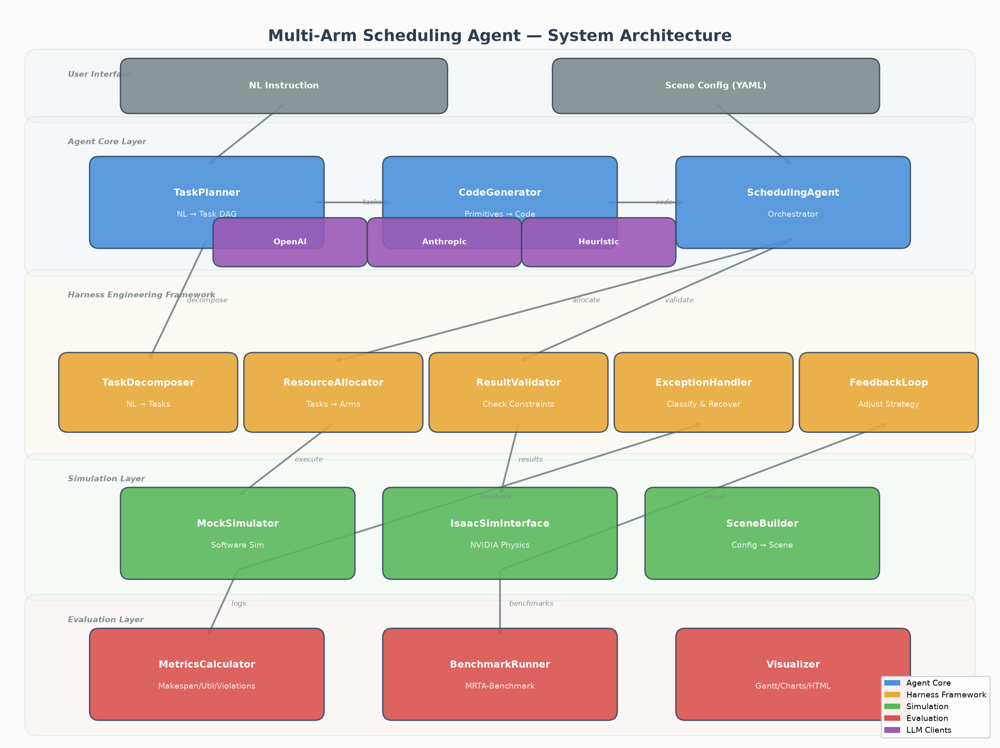
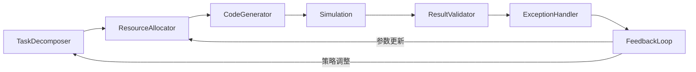

# Concepts

本页介绍系统的核心概念和数据流。

## 系统总览

系统由四层组成：



```
用户输入 (自然语言指令 + 场景配置)
    │
    ▼
┌─────────────────────────────────┐
│         智能体核心层              │
│  TaskPlanner → CodeGenerator    │
│  ← SchedulingAgent 编排 →       │
└───────────────┬─────────────────┘
                │
┌───────────────▼─────────────────┐
│         Harness 约束框架          │
│  分解 → 分配 → 验证 → 异常处理    │
│  ← FeedbackLoop 闭环 →          │
└───────────────┬─────────────────┘
                │
┌───────────────▼─────────────────┐
│         仿真执行层                │
│  MockSimulator / IsaacSim       │
└───────────────┬─────────────────┘
                │
┌───────────────▼─────────────────┐
│         评估分析层                │
│  Metrics / Benchmark / Visualizer│
└─────────────────────────────────┘
```

## 核心概念

### Task（任务）

任务是调度的最小单位。每个任务对应产线上的一个操作步骤。

```python
@dataclass
class Task:
    id: str                          # 唯一标识，如 "t_001"
    name: str                        # 任务名，如 "pick_workpiece_A"
    description: str                 # 自然语言描述
    operation_type: str              # 操作类型：pick/assemble/inspect/...
    dependencies: List[str]          # 前置任务ID列表
    required_capabilities: List[str] # 所需能力：["pick", "gripper"]
    estimated_duration: float        # 预估耗时（秒）
    station_id: Optional[str]        # 所属工位
    workpiece_id: Optional[str]      # 操作的工件
    assigned_arm: Optional[str]      # 分配的机械臂
    status: TaskStatus               # pending/in_progress/completed/failed
```

任务之间通过 `dependencies` 形成**有向无环图（DAG）**：

```
t_001 (pick A)  ──→  t_002 (assemble A)  ──→  t_003 (inspect A)
t_004 (pick B)  ──→  t_005 (assemble B)  ──→  t_006 (inspect B)
```

系统按拓扑层级执行：同一层级的任务可并行，不同层级必须串行。

### RobotArm（机械臂）

机械臂是执行任务的物理单元，具有特定的能力集合。

```python
@dataclass
class RobotArm:
    id: str                    # "arm_001"
    name: str                  # "Left Arm"
    capabilities: List[str]    # ["pick", "place", "assemble", "gripper"]
    is_busy: bool              # 当前是否在执行任务
    total_busy_time: float     # 累计忙碌时间
```

### Atomic Primitives（原子原语）

原子原语是代码生成的基本构建块。系统基于任务需求**动态组合**这些原语生成执行代码：

| 原语 | 用途 |
|------|------|
| `move_to(x, y, z, speed)` | 绝对位置移动 |
| `linear_move(dx, dy, dz, speed)` | 相对位移 |
| `grip(force)` | 闭合夹爪 |
| `release()` | 释放工件 |
| `rotate(roll, pitch, yaw, speed)` | 旋转末端执行器 |
| `wait(duration)` | 等待 |
| `check_sensor(sensor_type)` | 读取传感器 |
| `set_payload(mass)` | 声明负载 |
| `set_compliance(sx, sy, sz)` | 设置柔顺控制 |

!!! warning "不是固定技能库"
    系统**不维护**一个预置的 `pick_skill()` / `assemble_skill()` 函数库。每次代码生成都是根据具体任务参数（目标位置、力控参数、传感器类型等）从原语实时组合。同一个 `pick` 操作，不同工件、不同位置会生成不同的代码。

### Scene（场景）

场景定义了产线的物理布局：

```python
scene = {
    "stations": [...],      # 工位列表
    "workpieces": [...],    # 工件列表
    "robot_arms": [...],    # 机械臂列表
    "constraints": [...],   # 约束条件
}
```

### Harness Engineering

Harness 是系统的约束框架，包含5个模块：



详见 [Harness Framework](harness.md)。

## 数据流

### 完整调度流程

```
1. 用户输入
   "Pick two workpieces, assemble, inspect, and package"

2. TaskPlanner.create_plan()
   → 8 tasks with dependency graph

3. ResourceAllocator.allocate()
   → {t_001: arm_003, t_002: arm_001, ...}

4. CodeGenerator.generate() × 8
   → 8 Python functions using atomic primitives

5. Simulation.execute_action() × 8
   → ActionResult(success=True, duration=2.1, ...)

6. FeedbackLoop.collect() → analyze() → adjust()
   → StrategyAdjustment(timeout=5.0 → 8.0)

7. ExecutionResult
   → makespan, success_rate, utilization, violations
```

### 反馈闭环

当任务执行失败或超时时：

```
失败 → ExceptionHandler.handle()
         │
         ├── retry  → CodeGenerator(feedback=error) → 重新执行
         ├── replan → TaskPlanner(adjusted_params) → 重新分配
         ├── skip   → 标记失败，继续下一任务
         └── fallback → 使用模板代码重新执行
```

## 关键设计决策

### 为什么用动态代码生成？

| 方案 | 优点 | 缺点 |
|------|------|------|
| 固定技能库 | 简单、确定性 | 无法覆盖所有场景，不够灵活 |
| **动态代码生成** | 灵活、可适配任意任务 | 代码质量依赖LLM/模板 |

系统选择动态代码生成，因为工业场景千变万化，固定技能库无法满足所有需求。

### 仿真器选择

| 仿真器 | 环境要求 | 用途 |
|--------|---------|------|
| **MockSimulator** | CPU即可 | 开发调试、CI/CD、逻辑验证 |
| **IsaacSimInterface** | **NVIDIA RTX GPU (8GB+)** | 最终仿真验证（任务要求） |

**任务要求**：系统需"接入Isaac Sim、Omniverse或Isaac Lab仿真接口完成执行验证"。
Isaac Sim基于Omniverse平台，**必须使用NVIDIA RTX GPU**（最低RTX 3070）。

- 开发阶段：用MockSimulator在CPU上验证调度逻辑
- 最终验证：用Isaac Sim在GPU上进行物理仿真（碰撞检测、力学模拟）

无GPU时可使用云端GPU实例（如AWS EC2 G5/P4d，NVIDIA A10G/A100）。
